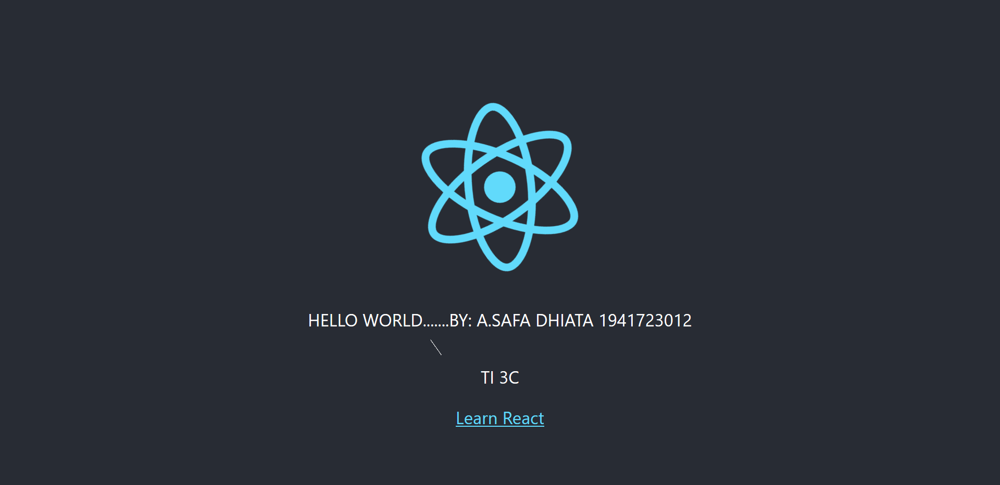

# 02 - Hello World

## Tujuan Pembelajaran

1. Mahasiswa memahami konsep ReactJS
2. Mahasiswa dapat membuat project menggunakan ReactJS

## Praktikum 2

[Kode Program Praktikum 2 (index)](../../src/02_Hello_world//hello_react/src/index.js)

[Kode Program Praktikum 2 (app)](../../src/02_Hello_world//hello_react/src/App.js)
