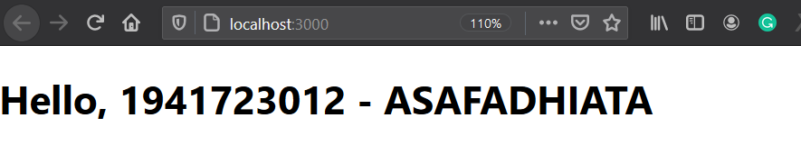
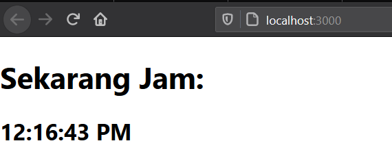
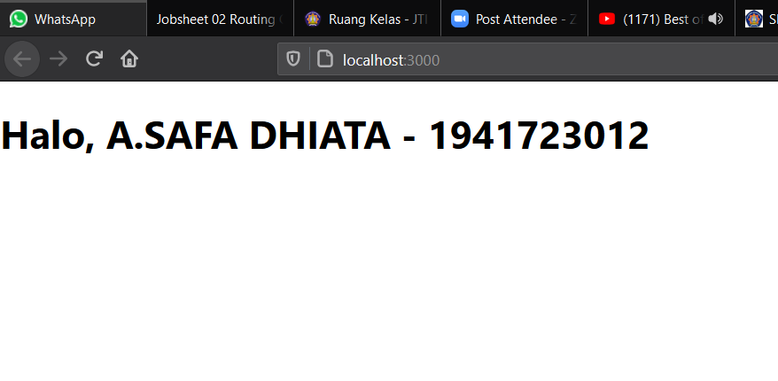
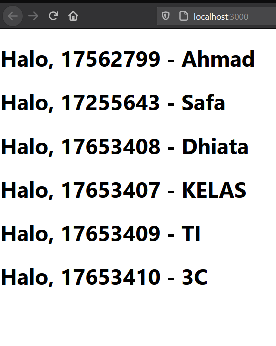
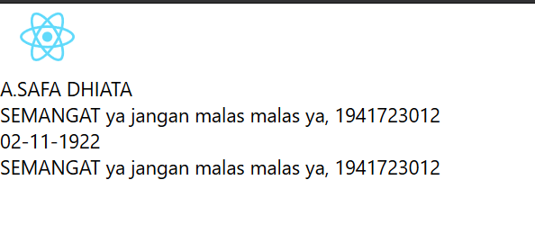
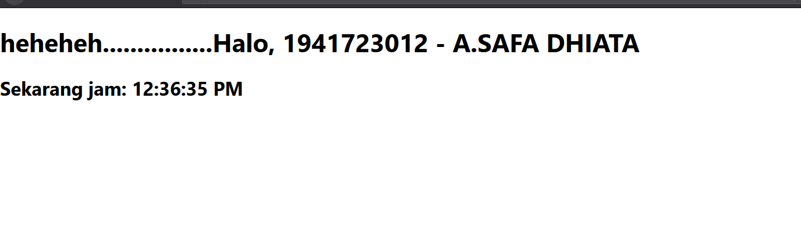
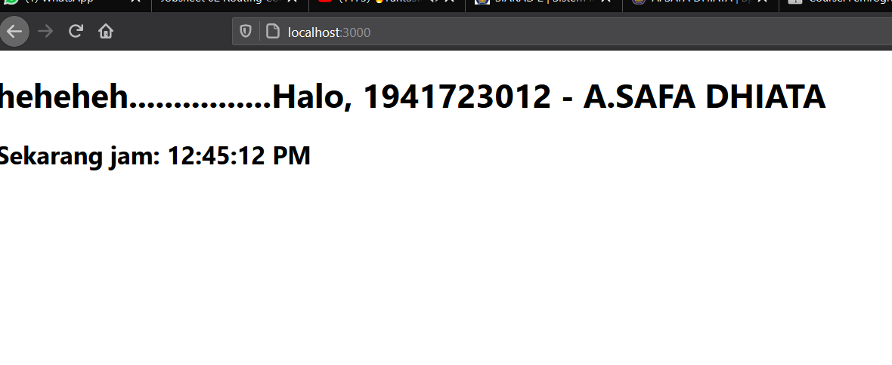

# 03 - Konsep Dasar dan Komponen ReactJS

## Tujuan Pembelajaran

1. Mahasiswa memahami konsep dasar ReactJS
2. Mahasiswa dapat membuat komponen dalam ReactJS

## Hasil Praktikum

[Kode Program Praktikum1](../../src/03_konsep_reactjs/praktikum1/index.js)

[Kode Program Praktikum2](../../src/03_konsep_reactjs/praktikum2/index.js)

[Kode Program Praktikum3](../../src/03_konsep_reactjs/praktikum3/index.js)

[Kode Program Praktikum4, Index](../../src/03_konsep_reactjs/praktikum4/index.js)

[Kode Program Praktikum4, App](../../src/03_konsep_reactjs/praktikum4/App.js)

[Kode Program Praktikum5](../../src/03_konsep_reactjs/praktikum5/App.js)

[Kode Program Praktikum6](../../src/03_konsep_reactjs/praktikum6/index.js)
