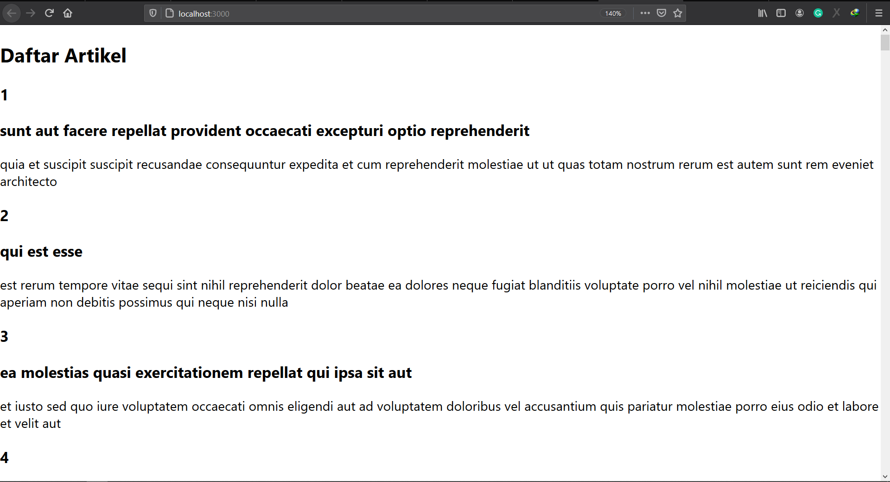
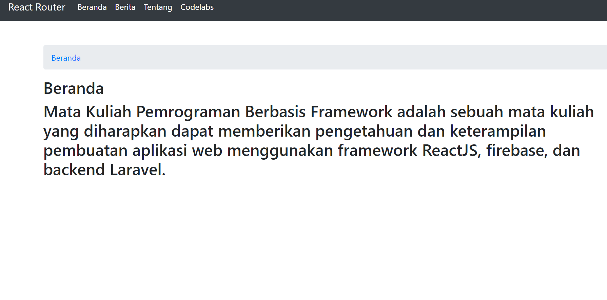

# 05 - API dan Router di ReactJs

## Tujuan Pembelajaran

1. Mahasiswa memahami konsep interaksi dalam ReactJS
2. Mahasiswa dapat membuat interaksi ReactJS dengan API
3. Mahasiswa memahami konsep React Router
4. Mahasiswa dapat melakukan instalasi React Router
5. Mahasiswa dapat membuat fitur berpindah halaman dengan React Router

## Hasil Praktikum

### Praktikum 1

[Source Code index.js](../../src/05_API_dan_React_Router_di_ReactJS/praktikum1/index.js)
  

### Praktikum 2

[Source Code index.js](../../src/05_API_dan_React_Router_di_ReactJS/praktikum2/index.js)

[Source Code App.js](../../src/05_API_dan_React_Router_di_ReactJS/praktikum2/App.js)
  

### Praktikum 3

[Source Code App.js](../../src/05_API_dan_React_Router_di_ReactJS/praktikum3/App.js)
  

## TUGAS (Bootstrap)

1. Gambar Beranda
    
2. Gambar Berita
    
3. Gambar Tentang
    
4. Gambar Codelabs
    

[Source Code App.js](../../src/05_API_dan_React_Router_di_ReactJS/tugas/App.js)