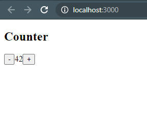

# 06 - React Redux

## Tujuan Pembelajaran

1. Konsep Redux dan manfaatnya
2. Instalasi dan konfigurasi Redux di ReactJS
3. Membuat aplikasi sederhana dengan Redux di ReactJS

## Hasil Praktikum

## Praktikum 

Untuk melihat kode Praktikum 1 langsung klik tautan berikut [Link Code 1](../../src/06_React_Redux/Praktikum_1/)

Untuk melihat kode Praktikum 2 langsung klik tautan berikut [Link Code 2](../../src/06_React_Redux/Praktikum_2/)

## Tugas
1. Jelaskan maksud sintaks <code>this.props.dispatch</code> pada praktikum langkah 16 sebelumnya!

2. Jelaskan maksud istilah yang ada dalam Redux berikut ini: Actions, Reducers, Action creators, Middleware, Pure functions, dan Immutability

3. Jelaskan maksud sintaks <code>export default connect(mapStateToProps)(Counter)</code> pada praktikum langkah 9 sebelumnya!

4. Carilah sebuah studi kasus aplikasi yang cukup kompleks di GitHub yang memanfaatkan Redux! Kemudian screenshot bagian kode program mana yang merupakan proses Redux dan jelaskan prosesnya! (cantumkan link repository GitHub yang Anda temukan)

## Jawab
1. <code>Store</code> adalah tempat untuk menyimpan data secara umum dan biasanya menggunakan <code>store.dispatch()</code>, akan tetapi ada beberapa kejadian yang mana component di app akan di <code>dispatch</code> dengan waktu bersamaan. Dalam kasus ini, komponen tersebut akan terjadi kesalahan akibat dari ketidakjelasan data yang akan disimpan di store. Oleh karena itu dibuatlah <code>this.props.dispatch()</code> agar komponen induknya langsung menyambung ke store dan di dispatch oleh child component

2. Berikut adalah arti dari istilah tersebut:
- Actions : Objek JavaScript ("{ }") yang memberitahu <code>reducer</code> untuk memodifikasi data. Syaratnya, <code>action</code> harus memiliki properti <code>type</code> berupa <code>String</code>
- Reducer : Sebuah function yang memiliki kembalian data (return some data)
- Action Creators : Fungsi yang berguna untuk mengembalikan action object
- Middleware : merupakan penengah antara aplikasi satu dengan yang lain dan mempemudah proses integrasi
- Pure Functions : Sintaks ini berguna untuk membangun suatu fungsi
- Immutability : Value yang tidak bisa diubah ketika sudah dideklerasikan

3. Sintaks tersebut merupakan higher-order function yang berarti untuk mengoneksikan atau mengembalikan fungsi ke default counter

4. Link : https://github.com/jfcere/react-redux-sample

