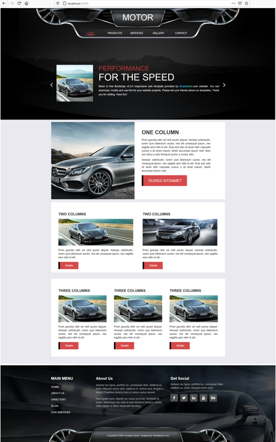

# 08 - Ujian Tengah Semester

Mata Kuliah : Pemrograman Berbasis Framework, Jurusan Teknologi Informasi, Polinema

Dosen Pengampu : Habibie Ed Dien, S.Kom., M.T.

# Identitas Mahasiswa
NIM : 1941723012

Nama : A.SAFA DHIATA

Kelas : TI-3C

## Tujuan Pembelajaran
Menguji kemampuan mahasiswa selama setengah semester

## Soal
Anda diminta oleh sebuah perusahaan untuk mengonversi templat web pada tautan ini <link>https://s.id/templat-web</link> (sesuai pembagian presensi dari dosen) menjadi sebuah aplikasi React. Artinya, Anda harus mengubah HTML statis tersebut menjadi komponen-komponen React menjadi sebuah Single-Page Application (SPA). Selain itu, ada permintaan spesifikasi lain, yaitu:

- Anda diminta untuk menggunakan React Router pada setiap menu di web tersebut.

- Anda diminta untuk meletakkan semua konten (seperti artikel, link gambar, komentar, dsb) web di file JSON kemudian dipanggil dengan API (GET).

- Anda diminta untuk menggunakan Redux agar konten web tersimpan di store, sehingga proses GET API tidak membutuhkan waktu lebih lama (low latency)

## Penilaian
| No | Penilaian Poin | Poin |
|--|--|--|
| 1 | Aplikasi React (SPA) | 30 |
| 2 | Menggunakan React Router setiap menu | 15 |
| 3 | Menggunakan API ke file JSON | 15 |
| 4 | Menggunakan Redux | 20 |
| 5 | React Project Structure Best Practices for Scalable Application https://dev.to/syakirurahman/react-project-structure-best-practices-for-scalable-application-18kk | 10 |
| 6 | Ketepatan pengumpulan solusi, kerapian laporan dan penulisan | 10 |
| |<em>**Total Poin**</em>| 100 |

## Hasil 
Langkah untuk menyelesaikan proyek ini dimulai dari mengkonversi template terlebih dahulu yang mulanya dari HTML ke ReactJS yang bersifat SPA (Single Page App). 

Kemudian di React ini, kita dapat membuat Single Page Application (SPA) dengan memanfaatkan React Router. React Router sendiri adalah sekumpulan dari komponen navigasi yang dapat digabungkan (compose) secara deklaratif dengan aplikasi web. 

Setelah itu barulah meletakkan konten-konten yang dibutuhkan seperti artikel, gambar, dan masih banyak lagi. Yang terakhir ialah menggunakan redux, alasan menggunakan redux sendiri yaitu gampangnya membantu untuk menangani atau mengelola state. 

Setelah semua itu diintegrasikan maka jadilah projek yang diinginkan dan tidak lupa memenuhi aturan-aturan penilaian poin agar mendapatkan yang maksimal, berikut hasil screenshot dari semua itu.

# Fitur-fitur Aplikasi

# HOME

# PRODUCTS

# SERVICES

# GALERY

# CONTACT

 Kode Progam

- Aplikasi React

- React Router di halaman Home

- Penggunaan API File JSON

- Menggunakan Redux

Salah satu halaman yang menggunakan Redux [Source Code](../../src/08_UTS/src/component/Gallery.js)

- Struktur File

Berikut merupakan tautan kode program [Source Code](../../src/08_UTS)

# Kesimpulan
Berdasarkan proses yang telah saya lakukan dalam mengubah HTML statis menjadi komponen-komponen React menjadi sebuah Single-Page Application (SPA) CHEMICAL ELEMENTS. Berikut adalah spesifikasi yang telah saya selesaikan : 
- Aplikasi React (SPA)
- Menggunakan React Router setiap menu
- Menggunakan API ke file JSON
- React Project Structure Best Practices for Scalable Application https://dev.to/syakirurahman/react-project-structure-best-practices-for-scalable-application-18kk

