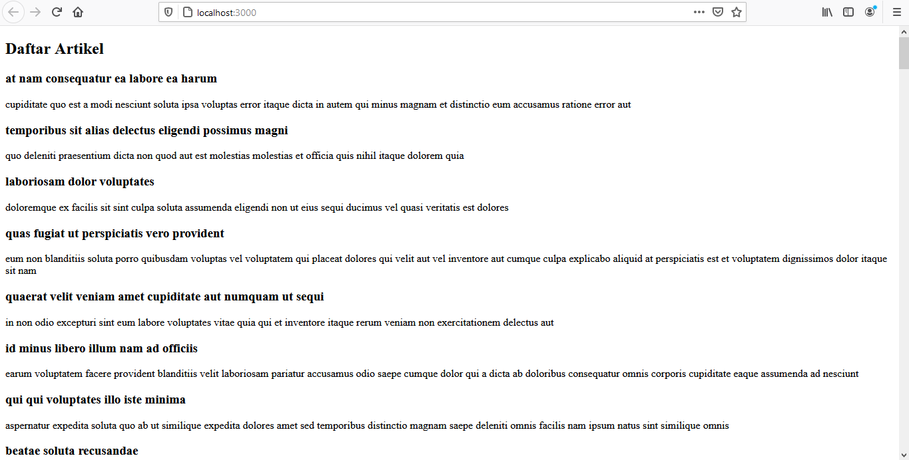
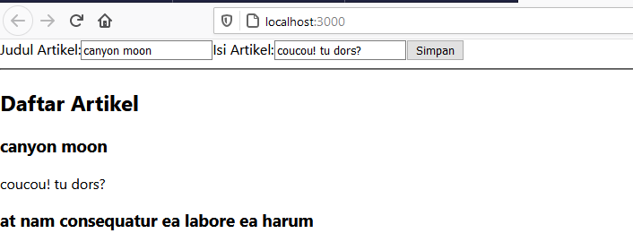
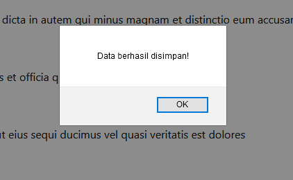
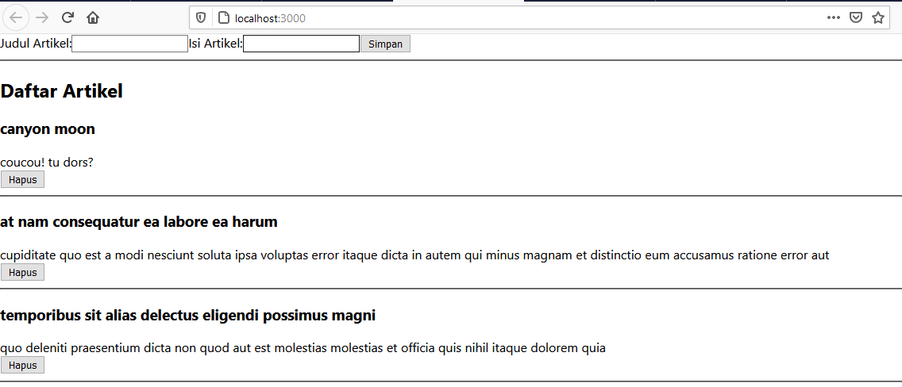
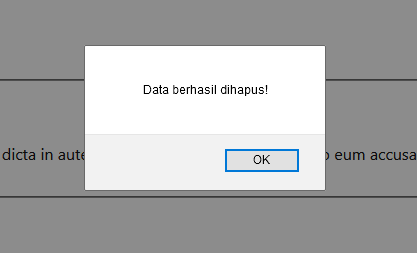
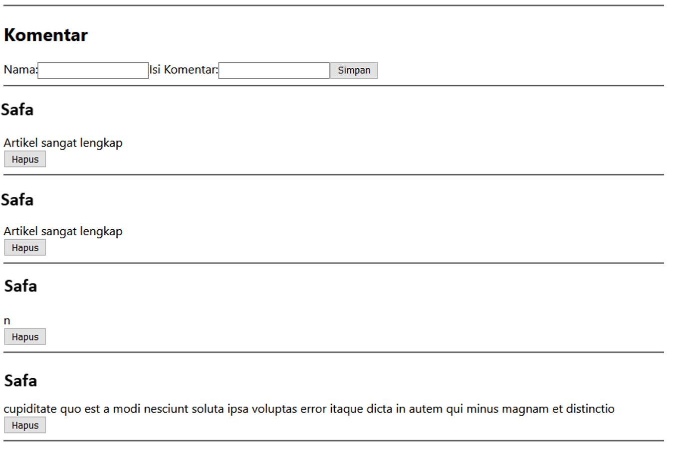

# 09 - Global API dan Hooks

## Tujuan Pembelajaran

1. Mahasiswa mengetahui dan memahami konsep Konsep dan implementasi Global API
2. Mahasiswa mengetahui dan memahami konsep dan implementasi Hooks

## Hasil Praktikum

Praktikum 1: Membuat Global API

1. Membuat Global API Service GET & Membuat Restful API Lokal

2. Membuat Global API Service POST

3. Membuat Global API Service DELETE

5. Mengelola Global API Service

[Kode Program Mengelola Global API Service](../../src/09_global_api_hooks/globalapi)

## Tugas Praktikum 1

[Kode Program komentar.js](../../src/04_konsep_reactjs_2/hello/src/components/Komentar.js)

[Kode Program folder komentar](../../src/04_konsep_reactjs_2/hello/src/services/Komentar/index.js)

