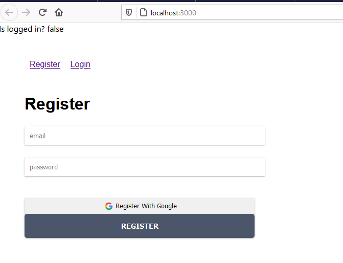

# 10 - Firebase di ReactJS

## Tujuan Pembelajaran

1. Mahasiswa mengetahui dan memahami konsep dan implementasi Firebase di ReactJS

## Hasil Praktikum

Praktikum 1: Membuat Form Register

[Kode Program src/App.js](../../src/10/frbase/src/App.js)

[Kode Program src/components/Header.js](../../src/10/frbase/src/components/Header.js)

[Kode Program src/components/routes.js](../../src/10/frbase/src/components/routes.js)

2. Membuat Form Login & Register

- Form Login

[Kode Program src/components/Login.js](../../src/10/frbase/src/components/Login.js)

- Form Register

[Kode Program src/components/Register.js](../../src/10/frbase/src/components/Register.js)

3. Membuat Koneksi ke Firebase

[Kode Program src/firebase.config.js](../../src/10/frbase/src/firebase.config.js)

[Kode Program src/App.js](../../src/10/frbase/src/App.js)

- Membuat Koneksi Firebase di Form Register

[Kode Program src/components/Register.js](../../src/10/frbase/src/components/Register.js)

- Membuat Koneksi Firebase di Form Login

[Kode Program src/components/Login.js](../../src/10/frbase/src/components/Login.js)

## Tugas Praktikum 1

SS-1

SS-2

SS-3

 

