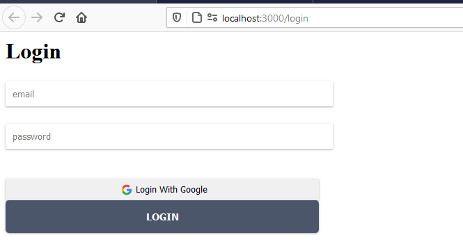
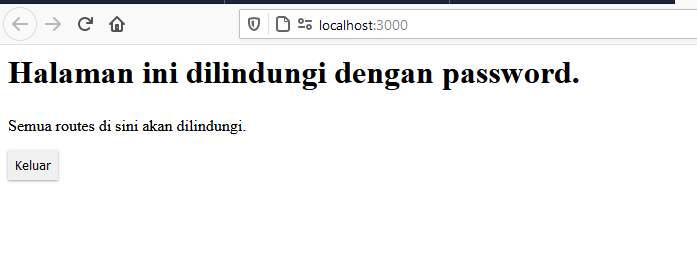

# 11 - Redux Thunk

## Tujuan Pembelajaran

1. Mahasiswa mengetahui dan memahami konsep dan implementasi Redux-Thunk di ReactJS
2. Mahasiswa mengetahui dan memahami konsep dan implementasi Firebase Login dengan Redux-Thunk di ReactJS

## Hasil Praktikum

Praktikum: Membuat Login dengan Firebase dan Redux Thunk

Jika login sukses, maka akan mengarah ke komponen Home seperti pada gambar berikut.

## Tugas

1.	Berdasarkan praktikum yang telah Anda lakukan, jelaskan perbedaan fitur yang ada dalam komponen Login dan Home! Mengapa komponen Login tidak menggunakan class seperti pada komponen Home ?

Jawab : Agar penulisan code rapi dan mempersingkat penulisan code.

2.	Jelaskan kegunaan dan alur logika dari protectedRoute.js !

Jawab : File ini berfungsi untuk memvalidasi status user yang berhasil login. logika yang digunakan oleh function ini, memvalidasi nilai state isAuthenticated yang disimpan di dalam store redux. jika state tersebut value atau nilai-nya false maka dia akan me-redirect halaman login.

3.	Coba lakukan login dengan email atau password yang salah, apa yang terjadi? Jelaskan!

Jawab : login akan gagal, action akan memperoses data yang di kirim oleh user dan response data tersebut akan di tampung oleh action-type LOGIN_FAILURE. di reducer akan merubah state value loginError menjadi true

4. Jika Anda berada di halaman Home, coba akses form login tanpa melakukan logout. Apakah form login bisa diakses? Jelaskan!

Jawab : Form login tidak bisa diakses. karena state isAuthenticated masih bernilai true. make file atau function protectedRoute.js tidak akan me-redirect ke halaman login

