# 12 - CRUD Firebase

## Tujuan Pembelajaran
1. Mahasiswa dapat mempelajari membuat blogpost yang terhubung ke CRUD Firebase

## Hasil Praktikum

1. Source Code

    1. Praktikum 1

        a. firebase.config.js

        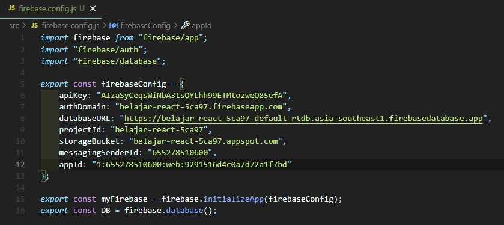

        b. rule

        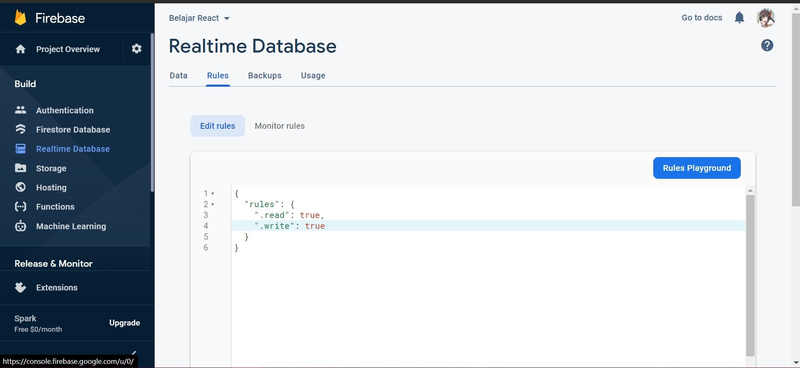

    2. Praktikum 2

        a. Blogpost

        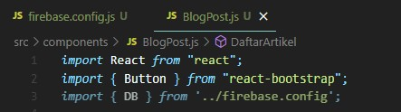

        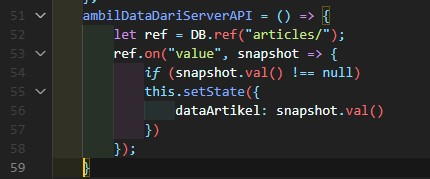

        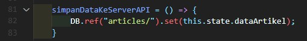

        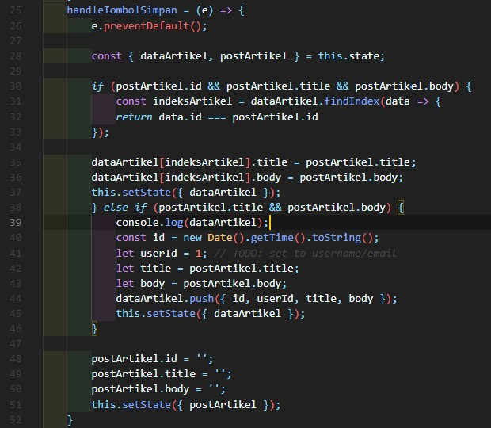

        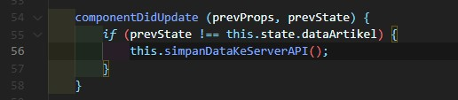

        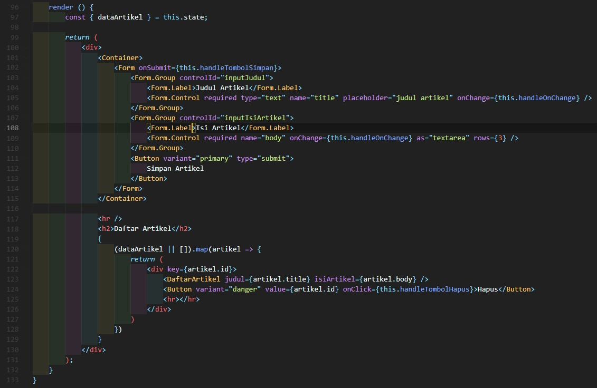

        b. Home

        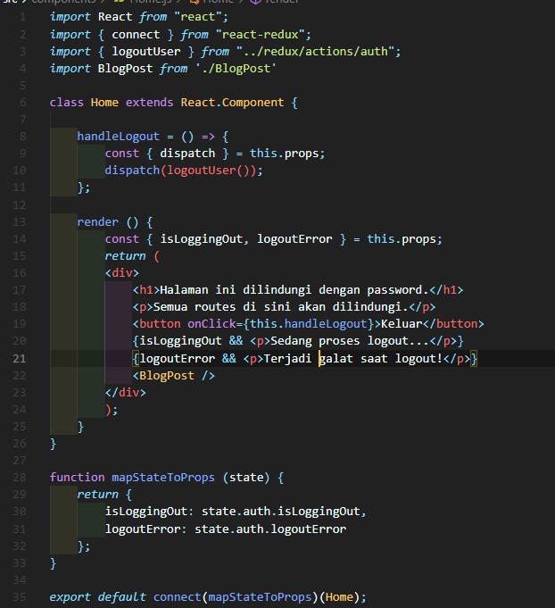

    3. Praktikum 3

        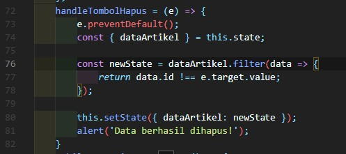

    4. Praktikum 4

        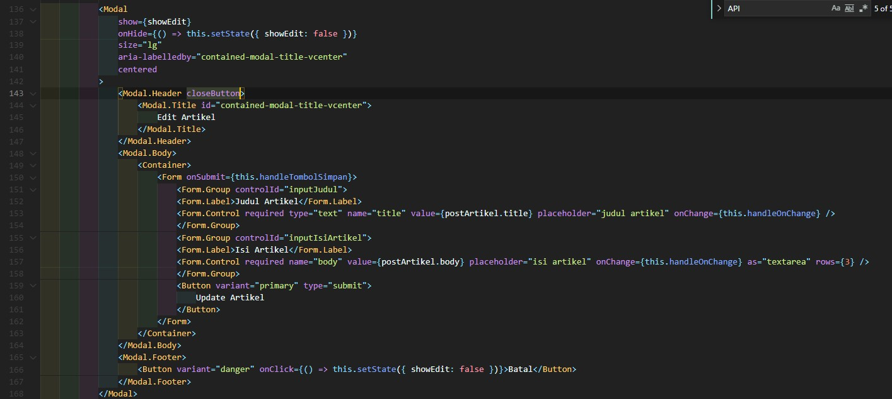

        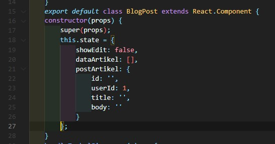

        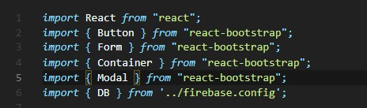

2. Hasil Tampilan

    1. Praktikum 2

        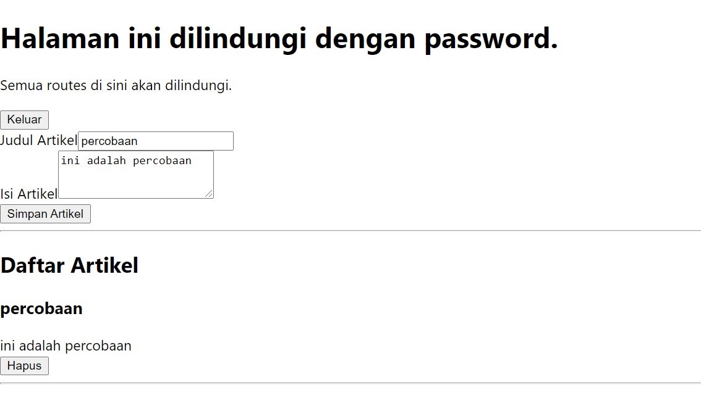

    2. Praktikum 3
        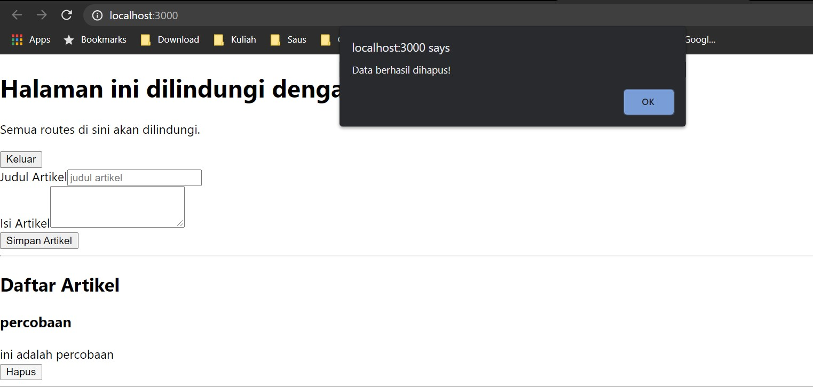

    3. Praktikum 4
        ![SS-2-3]

3. Tugas
