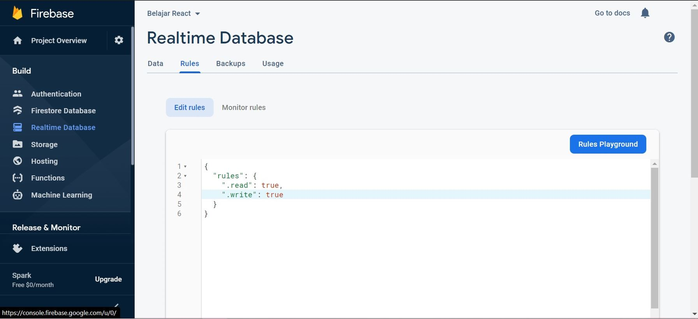

# 12 - CRUD Firebase

## Tujuan Pembelajaran
1. Mahasiswa dapat mempelajari membuat blogpost yang terhubung ke CRUD Firebase

## Hasil Praktikum

1. Source Code

    1. Praktikum 1

        a. firebase.config.js

        

        b. rule

        

    2. Praktikum 2

        a. Blogpost

        

        

        

        

        

        

        b. Home

        

    3. Praktikum 3

        

    4. Praktikum 4

        

        

        

2. Hasil Tampilan

    1. Praktikum 2

        

    2. Praktikum 3
        

    3. Praktikum 4
        ![SS-2-3]

### Praktikum 3: Membuat Fungsi Hapus Artikel

`Screenshot:`

### Praktikum 4: Membuat Fungsi Edit (Update) Artikel

`Screenshot:`

## Tugas

1. Berdasarkan praktikum 1 yang telah Anda lakukan, jelaskan perbedaan fungsi locked mode dan test mode pada langkah 3 saat Anda konfigurasi database Firebase?
2. Buatlah variabel userId pada praktikum 2 langkah 4 agar dapat menyimpan email dari user yang sedang login, sehingga dapat tersimpan di database!
3. Jelaskan maksud kode ini (dataArtikel || []) pada praktikum 2 langkah 6! Mengapa berbeda dari codelabs sebelumnya untuk menampilkan daftar artikel?
4. Lengkapilah kode pada praktikum 4 langkah 5 agar dapat melakukan update artikel! Mengapa setelah klik tombol Update Artikel, form Modal tidak hilang? Bagaimana Anda mengatasi hal tersebut?
5. Ketika Anda menekan tombol Edit, lalu menekan tombol Batal pada form Modal update artikel. Kemudian coba tambah artikel baru, maka artikel yang tadi kita klik tombol Edit akan berubah jadi data yang artikel baru ditambahkan. Mengapa demikian? Silakan diperbaiki.

`Jawab:`

1. Perbedaan dari fungsi locked mode dan test mode adalah pada penulisan dan pembacaan data. Ketika masuk locked mode, maka data tidak akan bisa diakses maupun diolah karena pada pengaturannya diatur false dan sebaliknya pada test mode, data bisa diakses dan diolah.

2. Database
    

3. Berfungsi untuk menampilkan map data dalam bentuk array ataupun objek. tidak seperti praktikum sebelumnya dimana data yang diambil hanya berbentuk objek.

4. Karena showEdit tidak diubah menjadi false.
    

5. Karena pada onSubmit masih memanggil fungsi `handleTombolSimpan`. sehingga data baru akan tersimpan.

