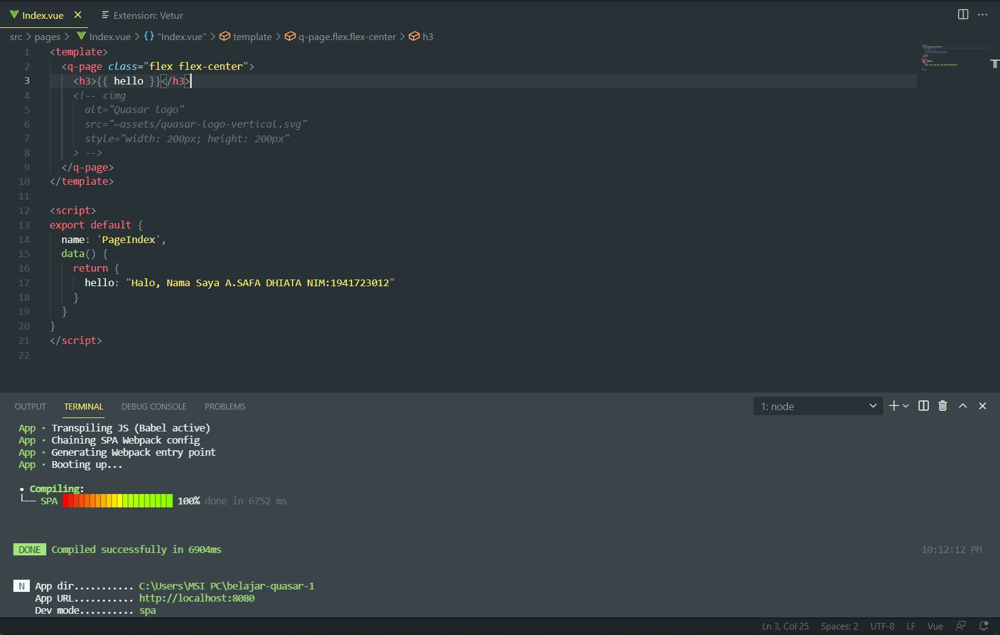

# 13 - Pengenalan Quasar Framework

## Tujuan Pembelajaran
1. Mahasiswa dapat mempelajari dasar framework Quasar

## Hasil Praktikum

1. Source Code

    1. Praktikum 1

        a. Konfigurasi

        

        

    2. Praktikum 2

        a. index

        

2. Hasil Tampilan

    1. Praktikum 2

        

3. Tugas
