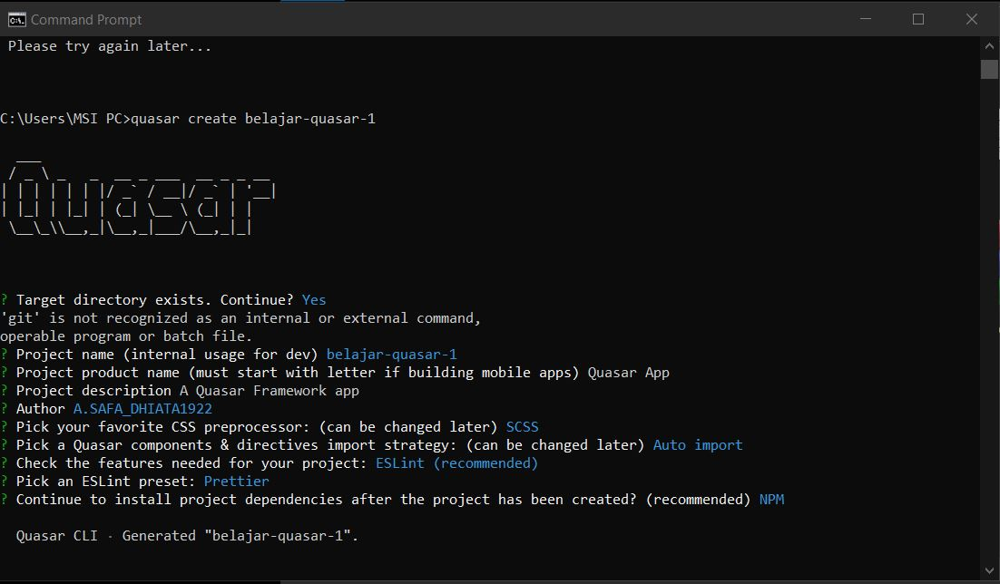
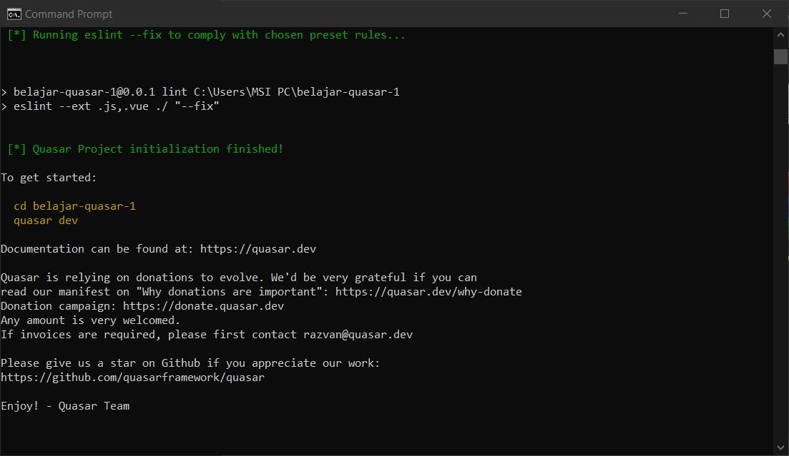

# Laporan Praktikum #13

## Tujuan Pembelajaran

1. Mahasiswa paham dengan konsep dasar Quasar

## Kode Program

`Kode Program:`

- [Kode Program](../../src/12_crud_firebase/firebase-app)

## Praktikum

### Praktikum 1: Memulai Quasar Framework

`Screenshot:`

### Praktikum 2: Membuat Aplikasi Pertama

`Screenshot:`

3. Tugas
    1. Berdasarkan praktikum 1 yang telah Anda lakukan, jelaskan kegunaan file quasar.conf.js ?
        Jawaban: Untuk konfigurasi file Quasar yang berisi omponents, directives, dan plugins yang akan digunakan.
        Sumber: https://quasar.dev/quasar-cli/quasar-conf-js

    2. Jelaskan maksud istilah SPA, SSR, PWA, BEX, Electron app, Cordova, dan Linting code!
        Jawaban:
        
         - SPA: Adalah aplikasi web atau situs web yang berinteraksi dengan pengguna dengan secara dinamis menulis ulang halaman saat ini daripada memuat seluruh halaman baru dari server.
            Sumber: https://quasar.dev/quasar-cli/developing-spa/introduction
        
         - SSR: Quasar dan Vue.js adalah kerangka kerja untuk membangun aplikasi sisi klien. Secara default, komponen Quasar Vue menghasilkan dan memanipulasi DOM di browser sebagai output. Namun, juga dimungkinkan untuk merender komponen yang sama ke dalam string HTML di server, mengirimkannya langsung ke browser, dan akhirnya "menghidrasi" markup statis menjadi aplikasi yang sepenuhnya interaktif di klien.
            Sumber: https://quasar.dev/quasar-cli/developing-ssr/introduction
        
         - PWA: Aplikasi web yang menggunakan kemampuan web modern untuk memberikan pengalaman seperti aplikasi kepada pengguna. Aplikasi ini memenuhi persyaratan tertentu (lihat di bawah), disebarkan ke server web dan dapat diakses melalui URL (pada protokol HTTPS).
            Sumber: https://quasar.dev/quasar-cli/developing-pwa/introduction
        
         - BEX: Untuk mengizinkan Quasar untuk berkomunikasi dengan beberapa bagian dari BEX.
            Sumber: https://quasar.dev/quasar-cli/developing-browser-extensions/bex-communication
        
         - Electron app: Kerangka kerja sumber terbuka yang dibuat oleh Cheng Zhao, dan sekarang dikembangkan oleh GitHub. Ini memungkinkan pengembangan aplikasi GUI desktop menggunakan komponen front dan back end yang awalnya dikembangkan untuk aplikasi web: runtime Node.js untuk backend dan Chromium untuk frontend. Electron adalah kerangka kerja GUI utama di balik beberapa proyek sumber terbuka terkenal termasuk Atom GitHub dan editor kode sumber Visual Studio Code Microsoft, aplikasi desktop layanan streaming musik Tidal dan Light Table IDE, selain klien desktop freeware untuk layanan obrolan Discord.
            Sumber: https://quasar.dev/quasar-cli/developing-electron-apps/introduction
         
         - Cordova: Kerangka kerja pengembangan aplikasi seluler yang awalnya dibuat oleh Nitobi. Adobe Systems membeli Nitobi pada tahun 2011, mengganti namanya menjadi PhoneGap, dan kemudian merilis versi open source dari perangkat lunak yang disebut Apache Cordova.
            Sumber: https://quasar.dev/quasar-cli/developing-cordova-apps/introduction
        
         - Linting code: Adalah pemeriksaan otomatis kode sumber Anda untuk kesalahan program dan gaya. Ini dilakukan dengan menggunakan alat lint (atau dikenal sebagai linter). Alat lint adalah penganalisis kode statis dasar.
            Sumber: https://www.perforce.com/blog/qac/what-lint-code-and-why-linting-important#what-is

    3. Jelaskan maksud dan perbedaan ES6, ECMAScript 6, dan ECMAScript 2015 !
        Jawaban: Mereka adalah bahasa pemrograman yang sudah distandarisasi oleh EMCA.
            Sumber: https://www.w3schools.com/js/js_es6.asp
